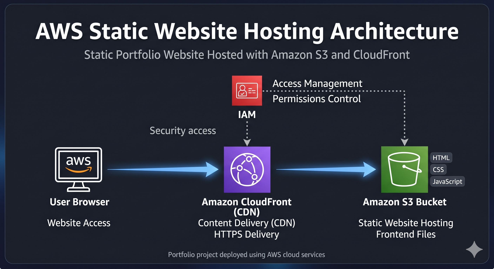

AWS Static Website Hosting Project :

I built this project to move beyond running websites locally and understand how static hosting actually works in AWS.

Since this was one of my first hands-on cloud projects, my main goal was simple: get different AWS services working together and understand what each one actually does.

The final result is a personal portfolio website hosted using Amazon S3 and delivered through CloudFront.

I also explored IAM and Route 53 to understand how a more complete AWS hosting setup works.

A) What I Built

This project is a simple cloud portfolio website.

The website includes:
- Landing / intro section
- Cloud engineering focus
- AWS project section

For the frontend, I used HTML, CSS, and JavaScript.

The main learning focus here was AWS deployment rather than frontend complexity.

B) AWS Services :

1) Amazon S3 :

I used an S3 bucket to host the website files.

I uploaded the frontend files (`index.html`, `style.css`, and `script.js`) and enabled static website hosting so the website could be opened through the browser.

2) Amazon CloudFront :

Once the website was working in S3, I wanted to understand how websites are delivered faster globally.

So I connected CloudFront to the S3 website endpoint and used it as a CDN layer.

At first, the website was not opening properly. After checking the settings, I realized I had missed configuring the default root object.

After setting `index.html`, everything started working normally.

3) IAM :

Instead of only using the AWS root account, I created an IAM user called `portfolio-admin`.

This helped me understand AWS permissions and why AWS recommends not using the root account for normal work.

4) Route 53 :

I explored Route 53 while learning how custom domains are connected in AWS.

Right now, the website runs through the CloudFront domain URL.

C) Architecture :

Architecture diagram for the project:

Flow used:

User → CloudFront → S3 Static Website

IAM was used for access management.

Route 53 is part of the planned setup for a future custom domain.

D) Step-by-Step Deployment

1) Creating the Website

I first created the portfolio website locally and checked whether the layout and sections were working properly.

After that, I organized the files and prepared them for deployment.

2) Hosting Files in S3

I created an S3 bucket and uploaded the website files.

Then I enabled static website hosting and updated bucket permissions so the website could be accessed publicly.

This part took some trial and error because AWS permissions were new to me.

3) Adding CloudFront

Once the website was working in S3, I connected CloudFront to understand how CDN delivery works.

At first, the CloudFront URL did not load properly.

After checking the settings and searching for the reason, I realized I had missed configuring the default root object.

After setting `index.html`, everything started working normally.

That small issue helped me understand how CloudFront behaves when the root object is missing.

4) IAM Setup

After deployment was working, I created an IAM user to avoid depending only on the root account.

This helped me understand AWS user access and permissions better.

E) Screenshots

S3 Bucket

(screenshots/s3-bucket-files.png)

IAM User

(screenshots/iam-user-created.png)

CloudFront Distribution

(screenshots/cloudfront-enabled.png)

Live Website

(screenshots/live-portfolio-website.png)

F) Live Website

CloudFront URL:

https://d2mwvnzv26ldwz.cloudfront.net/

G) Challenges & Lessons

A few things became clearer while doing this project:

- Small AWS settings can affect deployment
- S3 hosting is simple but permissions matter
- CloudFront requires proper configuration

The biggest thing I learned was understanding how AWS services connect together.